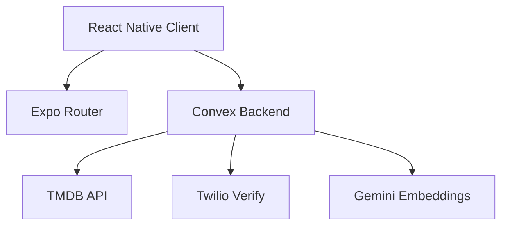
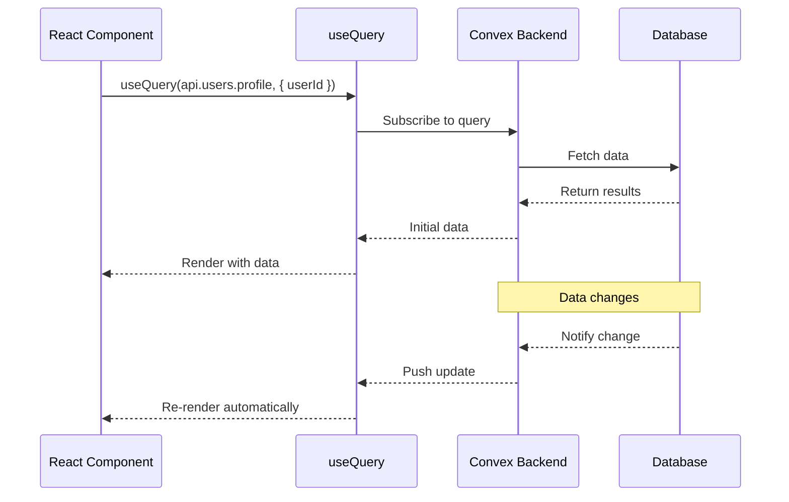
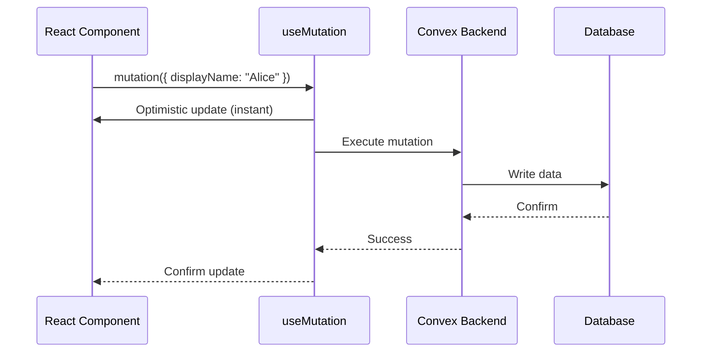
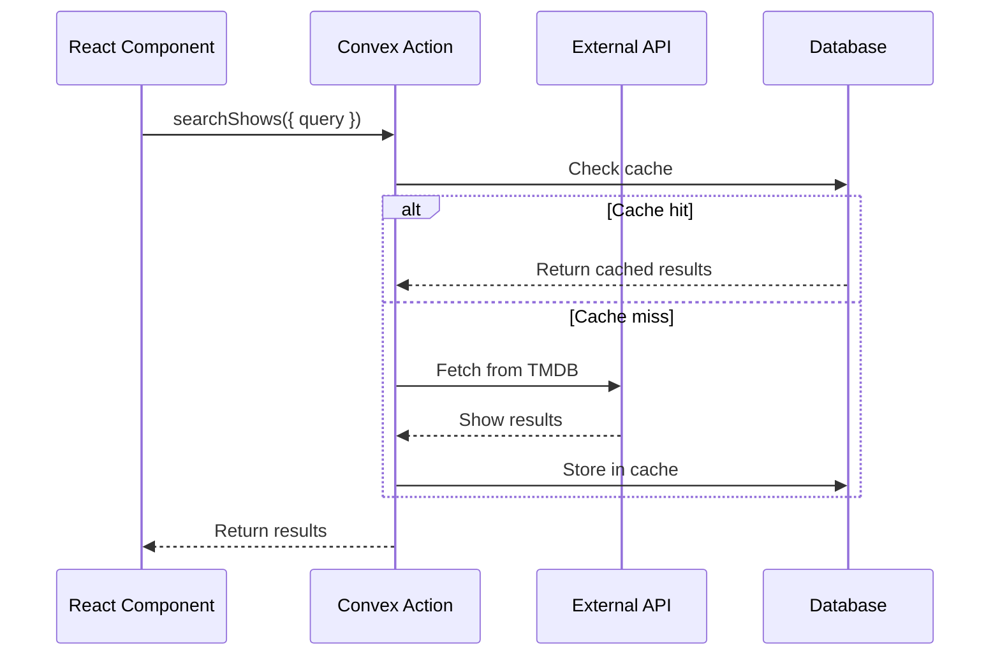

## System Architecture

Plotlist is built as a modern mobile-first application with a serverless backend. The architecture emphasizes real-time data synchronization, type safety, and developer experience.



## Frontend Stack

### Expo + React Native

The client is built with React Native using Expo, providing:

- **Cross-platform support**: iOS, Android, and Web from a single codebase
- **Native capabilities**: Camera, contacts, file system, and more
- **Hot reloading**: Fast iteration during development
- **OTA updates**: Deploy updates without app store approval

**Key dependencies:**
```json
{
  "expo": "~54.0.33",
  "react": "19.1.0",
  "react-native": "0.81.5"
}
```

### Expo Router

File-based routing for React Native:

- **Type-safe navigation**: Auto-generated types for routes
- **Deep linking**: URL-based navigation support
- **Nested layouts**: Shared UI across route groups
- **Authentication gates**: Protect routes based on auth state

**Route structure:**
```text
app/
├── (auth)/           # Unauthenticated routes
│   └── sign-in.tsx
├── (onboarding)/     # First-run onboarding
│   ├── profile.tsx
│   ├── follow.tsx
│   └── shows.tsx
├── (tabs)/           # Main app tabs
│   ├── home.tsx
│   ├── search.tsx
│   ├── log.tsx
│   └── profile.tsx
├── show/[id].tsx     # Dynamic routes
└── _layout.tsx       # Root layout
```

### NativeWind

Tailwind CSS for React Native:

```tsx
// Type-safe, utility-first styling
<View className="flex-1 bg-background px-4 py-2">
  <Text className="text-lg font-semibold text-foreground">
    Hello, Plotlist!
  </Text>
</View>
```

**Benefits:**
- Familiar Tailwind syntax
- Dark mode support
- Responsive design utilities
- Type-safe class names

### Animation & Gestures

- **React Native Reanimated**: 60fps animations on native thread
- **Gesture Handler**: Native gesture recognition
- **FlashList**: High-performance lists with recycling

## Backend Stack

### Convex

Convex is the complete backend solution:

<CardGroup cols={2}>
  <Card title="Database" icon="database">
    Document database with automatic indexing and real-time queries
  </Card>
  <Card title="Functions" icon="code">
    Type-safe queries, mutations, and actions with automatic API generation
  </Card>
  <Card title="Real-time" icon="bolt">
    WebSocket-based subscriptions for live data updates
  </Card>
  <Card title="Scheduled Jobs" icon="clock">
    Cron jobs for background tasks and data maintenance
  </Card>
</CardGroup>

**Core features:**
- **Reactive queries**: Components auto-update when data changes
- **Optimistic updates**: Instant UI feedback
- **Type generation**: End-to-end TypeScript types
- **File storage**: Built-in blob storage
- **Vector search**: Embeddings for recommendations

### Convex Auth

Authentication built on Convex:

```typescript
import { convexAuth } from "@convex-dev/auth/server";
import { ConvexCredentials } from "@convex-dev/auth/providers/ConvexCredentials";

export const { auth, signIn, signOut } = convexAuth({
  providers: [
    ConvexCredentials({
      id: "phone",
      authorize: async (credentials, ctx) => {
        // Custom phone verification logic
      },
    }),
  ],
});
```

**Features:**
- Session management
- Phone-based authentication
- User identity across requests
- Secure token storage

## External Services

### TMDB (The Movie Database)

**Purpose**: TV show metadata, search, and discovery

**What we fetch:**
- Show details (title, poster, overview, cast)
- Episode guides and season data
- Trending shows and recommendations
- Streaming provider information
- Release dates and schedules

**Caching strategy:**
- Search results: 24 hours
- Show details: 7 days
- Season data: 7 days (recent) to 180 days (archived)

### Twilio Verify

**Purpose**: Phone number verification via SMS OTP

**Flow:**
1. User enters phone number
2. Convex action calls Twilio to send verification code
3. User enters code
4. Convex validates code with Twilio
5. Session created on success

**Rate limiting:**
- 5 verification attempts per phone per 10 minutes
- Prevents abuse and spam

### Google Gemini

**Purpose**: Generate embeddings for personalized recommendations

**Use cases:**
- Semantic show similarity
- Taste-based recommendations
- User preference matching
- Freeform search ("comfort comedy", "slow-burn sci-fi")

**Embedding strategy:**
- 1536-dimension vectors
- Separate similarity and retrieval embeddings
- Cached in `showEmbeddings` table
- Indexed with vector search

## Data Flow

### Query Flow



### Mutation Flow



### Action Flow (External API)



## Component Organization

### App Directory (Screens)

**`app/(auth)/`** - Authentication flow
- `sign-in.tsx`: Phone number entry and verification

**`app/(onboarding)/`** - First-run experience
- `profile.tsx`: Set up username and bio
- `follow.tsx`: Discover contacts and users
- `shows.tsx`: Select favorite shows

**`app/(tabs)/`** - Main navigation
- `home.tsx`: Activity feed and recommendations
- `search.tsx`: Discover shows and people
- `log.tsx`: Track watched episodes
- `profile.tsx`: User profile and settings

**`app/show/[id].tsx`** - Show detail page
- Poster, metadata, and overview
- Episode guide with progress tracking
- Reviews and similar shows

### Components Directory

Reusable UI building blocks:

```text
components/
├── AuthGate.tsx          # Protect authenticated routes
├── ShowCard.tsx          # Show poster cards
├── ReviewCard.tsx        # Review display
├── EpisodeList.tsx       # Season episode guide
├── UserAvatar.tsx        # Profile pictures
└── FeedItem.tsx          # Activity feed items
```

### Convex Directory (Backend)

**Core domains:**

```text
convex/
├── schema.ts             # Database tables and indexes
├── auth.ts               # Authentication logic
├── users.ts              # User profiles and settings
├── shows.ts              # Show catalog and TMDB
├── watchStates.ts        # Tracking status
├── watchLogs.ts          # Episode logs
├── reviews.ts            # Reviews and ratings
├── follows.ts            # Social graph
├── feed.ts               # Activity feed
├── lists.ts              # User-curated lists
├── releaseCalendar.ts    # Upcoming episodes
├── embeddings.ts         # Recommendations
├── crons.ts              # Background jobs
└── _generated/           # Auto-generated types
```

### Lib Directory (Client Utilities)

```text
lib/
├── convex.ts             # Convex client setup
├── authStorage.ts        # Secure token storage
├── format.ts             # Date and number formatting
├── deviceContacts.ts     # Contact sync utilities
└── preferences.ts        # User preferences
```

## Background Jobs

Scheduled tasks in `convex/crons.ts`:

```typescript
const crons = cronJobs();

// Clean up expired TMDB cache every 6 hours
crons.interval(
  "cleanup expired tmdb cache",
  { hours: 6 },
  internal.maintenance.cleanupTmdbCache
);

// Refresh hot shows catalog every 6 hours
crons.cron(
  "hot show catalog refresh",
  "10 */6 * * *",
  internal.maintenance.scheduleHotShowCatalogRefresh
);

// Update release calendar for tracked shows
crons.cron(
  "tracked release refresh",
  "40 */6 * * *",
  internal.releaseCalendar.scheduleStaleTrackedShowRefresh
);
```

**Background tasks:**
- Cache expiration and cleanup
- Show catalog refresh from TMDB
- Episode cache updates
- Embedding generation
- Release calendar synchronization

## Performance Considerations

### Client Optimization

- **FlashList** for virtualized lists (thousands of items)
- **Image caching** with expo-image
- **Optimistic updates** for instant feedback
- **Query batching** to reduce network requests

### Backend Optimization

- **Indexes** on all query patterns
- **Caching** for external API calls
- **Vector search** for fast similarity matching
- **Pagination** for large result sets

### Data Caching

- TMDB search: 24 hours
- Show details: 7 days
- Season data: 7-180 days
- User profiles: Real-time
- Activity feed: Real-time

## Security

- **Phone verification** via Twilio OTP
- **Hashed phone numbers** for contact sync
- **Session tokens** in secure storage
- **Rate limiting** on sensitive operations
- **Content moderation** via reports

## Next Steps

<CardGroup cols={2}>
  <Card title="Convex Backend" icon="database" href="/development/convex-backend">
    Deep dive into Convex schema and functions
  </Card>
  <Card title="Authentication" icon="lock" href="/development/authentication">
    Learn about the auth implementation
  </Card>
</CardGroup>
