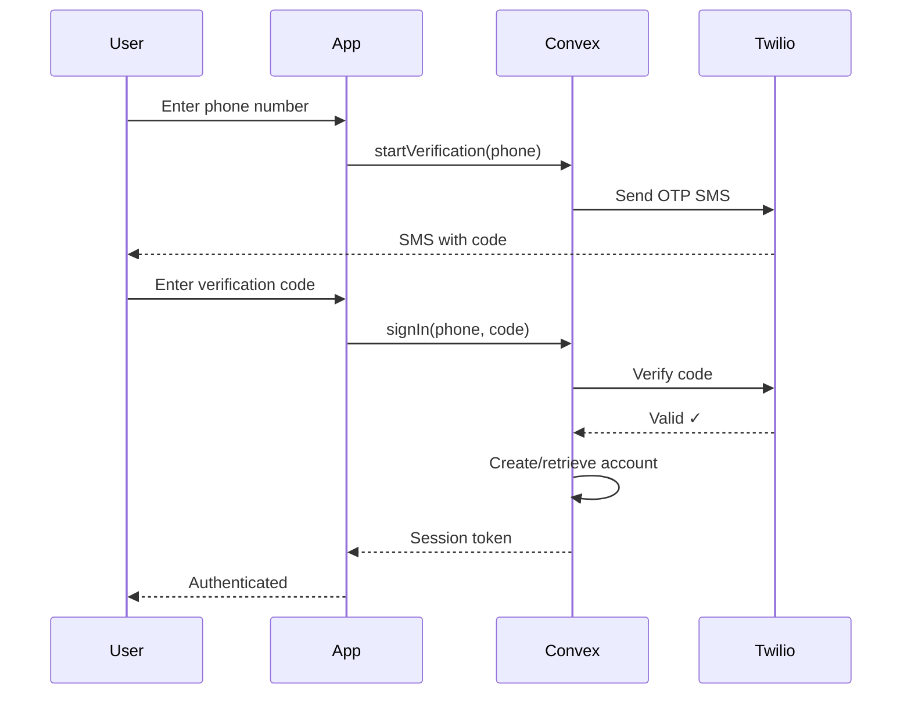

## Overview

Plotlist uses **Convex Auth** with **phone-based authentication** powered by **Twilio Verify OTP**. This provides a passwordless, secure authentication flow optimized for mobile devices.

## Authentication Flow



## Implementation

### Convex Auth Setup

The auth system is configured in `convex/auth.ts`:

```typescript
import { createAccount, convexAuth, retrieveAccount } from "@convex-dev/auth/server";
import { ConvexCredentials } from "@convex-dev/auth/providers/ConvexCredentials";
import { normalizePhoneNumber, verifyPhoneVerificationCode } from "./phone";

export const { auth, signIn, signOut, store, isAuthenticated } = convexAuth({
  providers: [
    ConvexCredentials({
      id: "phone",
      authorize: async (credentials, ctx) => {
        // Validate phone number
        if (typeof credentials.phone !== "string") {
          throw new Error("Enter a valid phone number");
        }
        if (typeof credentials.code !== "string") {
          throw new Error("Enter the verification code we sent you.");
        }

        // Normalize phone to E.164 format
        const normalizedPhone = normalizePhoneNumber(credentials.phone);
        if (!normalizedPhone) {
          throw new Error("Enter a valid phone number");
        }

        // Verify code with Twilio
        const isVerified = await verifyPhoneVerificationCode(
          normalizedPhone,
          credentials.code,
        );
        if (!isVerified) {
          return null;
        }

        // Try to retrieve existing account
        try {
          const { user } = await retrieveAccount(ctx, {
            provider: "phone",
            account: { id: normalizedPhone },
          });
          return { userId: user._id };
        } catch (error) {
          if (!(error instanceof Error) || error.message !== "InvalidAccountId") {
            throw error;
          }
        }

        // Create new account if not found
        const now = Date.now();
        const { user } = await createAccount(ctx, {
          provider: "phone",
          account: { id: normalizedPhone },
          profile: {
            name: normalizedPhone,
            phone: normalizedPhone,
            phoneVerificationTime: now,
            createdAt: now,
            lastSeenAt: now,
          },
          shouldLinkViaPhone: true,
        });

        return { userId: user._id };
      },
    }),
  ],
});
```

### Phone Verification

Twilio integration in `convex/phone.ts`:

```typescript
import { v } from "convex/values";
import { action } from "./_generated/server";
import { internal } from "./_generated/api";

// Normalize phone to E.164 format (+1XXXXXXXXXX)
export function normalizePhoneNumber(value: string) {
  const trimmed = value.trim();
  if (!trimmed) return null;

  // Handle international format
  if (trimmed.startsWith("+")) {
    const digits = trimmed.slice(1).replace(/\D/g, "");
    if (digits.length < 8 || digits.length > 15) {
      return null;
    }
    return `+${digits}`;
  }

  // Handle US numbers
  const digits = trimmed.replace(/\D/g, "");
  if (digits.length === 10) {
    return `+1${digits}`;
  }
  if (digits.length === 11 && digits.startsWith("1")) {
    return `+${digits}`;
  }
  return null;
}

// Send verification code via Twilio Verify
export async function sendPhoneVerificationCode(phoneNumber: string) {
  const normalizedPhone = normalizePhoneNumber(phoneNumber);
  if (!normalizedPhone) {
    throw new Error("Enter a valid phone number");
  }

  const serviceSid = process.env.TWILIO_VERIFY_SERVICE_SID!;
  const accountSid = process.env.TWILIO_ACCOUNT_SID!;
  const authToken = process.env.TWILIO_AUTH_TOKEN!;

  await fetch(
    `https://verify.twilio.com/v2/Services/${serviceSid}/Verifications`,
    {
      method: "POST",
      headers: {
        Authorization: `Basic ${btoa(`${accountSid}:${authToken}`)}`,
        "Content-Type": "application/x-www-form-urlencoded",
      },
      body: new URLSearchParams({
        To: normalizedPhone,
        Channel: "sms",
      }),
    }
  );
}

// Verify code with Twilio
export async function verifyPhoneVerificationCode(
  phoneNumber: string,
  code: string,
) {
  const normalizedPhone = normalizePhoneNumber(phoneNumber);
  if (!normalizedPhone) {
    throw new Error("Enter a valid phone number");
  }

  const trimmedCode = code.trim();
  if (!trimmedCode) {
    throw new Error("Enter the verification code we sent you.");
  }

  const serviceSid = process.env.TWILIO_VERIFY_SERVICE_SID!;
  const accountSid = process.env.TWILIO_ACCOUNT_SID!;
  const authToken = process.env.TWILIO_AUTH_TOKEN!;

  const response = await fetch(
    `https://verify.twilio.com/v2/Services/${serviceSid}/VerificationCheck`,
    {
      method: "POST",
      headers: {
        Authorization: `Basic ${btoa(`${accountSid}:${authToken}`)}`,
        "Content-Type": "application/x-www-form-urlencoded",
      },
      body: new URLSearchParams({
        To: normalizedPhone,
        Code: trimmedCode,
      }),
    }
  );

  const payload = await response.json();
  return payload.valid === true || payload.status === "approved";
}

// Action to start verification with rate limiting
export const startVerification = action({
  args: { phone: v.string() },
  handler: async (ctx, args) => {
    const normalizedPhone = normalizePhoneNumber(args.phone);
    if (!normalizedPhone) {
      throw new Error("Enter a valid phone number");
    }

    // Rate limit: 5 attempts per 10 minutes
    await ctx.runMutation(internal.rateLimit.enforce, {
      key: `phone-verification:${normalizedPhone}`,
      limit: 5,
      windowMs: 10 * 60 * 1000,
    });

    await sendPhoneVerificationCode(normalizedPhone);
    return null;
  },
});
```

### Client-Side Integration

Auth provider in `app/_layout.tsx`:

```tsx
import { ConvexAuthProvider } from "@convex-dev/auth/react";
import { convex } from "../lib/convex";
import { authStorage } from "../lib/authStorage";

export default function RootLayout() {
  return (
    <ConvexAuthProvider
      client={convex}
      storage={authStorage}
      storageNamespace="plotlist"
    >
      <AuthGate>
        <Stack screenOptions={{ headerShown: false }} />
      </AuthGate>
    </ConvexAuthProvider>
  );
}
```

Sign-in screen example:

```tsx
import { useAuthActions } from "@convex-dev/auth/react";
import { useAction } from "convex/react";
import { api } from "../convex/_generated/api";

export default function SignIn() {
  const { signIn } = useAuthActions();
  const startVerification = useAction(api.phone.startVerification);
  const [phone, setPhone] = useState("");
  const [code, setCode] = useState("");
  const [step, setStep] = useState("phone");

  const handleSendCode = async () => {
    try {
      await startVerification({ phone });
      setStep("code");
    } catch (error) {
      alert(error.message);
    }
  };

  const handleVerifyCode = async () => {
    try {
      await signIn("phone", { phone, code });
      // Success - user is now authenticated
    } catch (error) {
      alert("Invalid verification code");
    }
  };

  if (step === "phone") {
    return (
      <View>
        <Text>Enter your phone number</Text>
        <TextInput
          value={phone}
          onChangeText={setPhone}
          placeholder="+1 (555) 123-4567"
          keyboardType="phone-pad"
        />
        <Button onPress={handleSendCode} title="Send Code" />
      </View>
    );
  }

  return (
    <View>
      <Text>Enter verification code</Text>
      <TextInput
        value={code}
        onChangeText={setCode}
        placeholder="123456"
        keyboardType="number-pad"
      />
      <Button onPress={handleVerifyCode} title="Verify" />
    </View>
  );
}
```

### Auth Gate

Protect authenticated routes with `AuthGate.tsx`:

```tsx
import { useConvexAuth } from "convex/react";
import { Redirect } from "expo-router";

export function AuthGate({ children }: { children: React.ReactNode }) {
  const { isAuthenticated, isLoading } = useConvexAuth();

  if (isLoading) {
    return <LoadingScreen />;
  }

  if (!isAuthenticated) {
    return <Redirect href="/(auth)/sign-in" />;
  }

  return <>{children}</>;
}
```

## Session Management

### Secure Token Storage

Tokens are stored in `expo-secure-store` (`lib/authStorage.ts`):

```typescript
import * as SecureStore from "expo-secure-store";

export const authStorage = {
  async getItem(key: string) {
    return await SecureStore.getItemAsync(key);
  },
  async setItem(key: string, value: string) {
    await SecureStore.setItemAsync(key, value);
  },
  async removeItem(key: string) {
    await SecureStore.deleteItemAsync(key);
  },
};
```

### Getting Current User

Utility in `convex/utils.ts`:

```typescript
import { getAuthUserId } from "@convex-dev/auth/server";

export async function getCurrentUserOrThrow(ctx: QueryCtx | MutationCtx) {
  const userId = await getAuthUserId(ctx);
  if (!userId) {
    throw new Error("Not authenticated");
  }
  const user = await ctx.db.get(userId);
  if (!user) {
    throw new Error("User not found");
  }
  return user;
}
```

Usage:

```typescript
export const updateProfile = mutation({
  args: { displayName: v.string() },
  handler: async (ctx, args) => {
    const user = await getCurrentUserOrThrow(ctx);
    await ctx.db.patch(user._id, {
      displayName: args.displayName,
    });
  },
});
```

## App Review Bypass

For testing without burning through SMS credits, enable a bypass in development:

```typescript
// convex/phone.ts
const APP_REVIEW_TEST_PHONE = "+15551234567";
const APP_REVIEW_TEST_CODE = "123456";

function isAppReviewBypassEnabled() {
  return process.env.ALLOW_APP_REVIEW_OTP_BYPASS === "true";
}

function matchesAppReviewBypass(phoneNumber: string, code?: string) {
  if (!isAppReviewBypassEnabled()) {
    return false;
  }

  const testPhone = process.env.APP_REVIEW_TEST_PHONE ?? APP_REVIEW_TEST_PHONE;
  const normalizedBypassPhone = normalizePhoneNumber(testPhone);
  
  if (!normalizedBypassPhone || normalizedBypassPhone !== phoneNumber) {
    return false;
  }

  if (code === undefined) {
    return true;
  }

  const testCode = process.env.APP_REVIEW_TEST_CODE ?? APP_REVIEW_TEST_CODE;
  return code === testCode;
}

export async function sendPhoneVerificationCode(phoneNumber: string) {
  const normalizedPhone = normalizePhoneNumber(phoneNumber);
  if (!normalizedPhone) {
    throw new Error("Enter a valid phone number");
  }
  
  // Skip Twilio if bypass is enabled
  if (matchesAppReviewBypass(normalizedPhone)) {
    return;
  }
  
  // Normal Twilio flow...
}

export async function verifyPhoneVerificationCode(
  phoneNumber: string,
  code: string,
) {
  const normalizedPhone = normalizePhoneNumber(phoneNumber);
  if (!normalizedPhone) {
    throw new Error("Enter a valid phone number");
  }

  const trimmedCode = code.trim();
  if (!trimmedCode) {
    throw new Error("Enter the verification code we sent you.");
  }

  // Check bypass before hitting Twilio
  if (matchesAppReviewBypass(normalizedPhone, trimmedCode)) {
    return true;
  }

  // Normal Twilio verification...
}
```

**Environment variables:**

```bash
ALLOW_APP_REVIEW_OTP_BYPASS=true
APP_REVIEW_TEST_PHONE=+15551234567
APP_REVIEW_TEST_CODE=123456
```

<Warning>
  **Never enable this in production.** The bypass is only for local development and testing.
</Warning>

## Rate Limiting

Prevent abuse with rate limiting in `convex/rateLimit.ts`:

```typescript
export const enforce = mutation({
  args: {
    key: v.string(),
    limit: v.number(),
    windowMs: v.number(),
  },
  handler: async (ctx, args) => {
    const now = Date.now();
    const resetAt = now + args.windowMs;

    const existing = await ctx.db
      .query("rateLimits")
      .withIndex("by_key", (q) => q.eq("key", args.key))
      .unique();

    if (existing) {
      if (existing.resetAt < now) {
        // Window expired, reset counter
        await ctx.db.patch(existing._id, {
          count: 1,
          resetAt,
        });
        return;
      }

      if (existing.count >= args.limit) {
        throw new Error("Rate limit exceeded. Please try again later.");
      }

      await ctx.db.patch(existing._id, {
        count: existing.count + 1,
      });
    } else {
      await ctx.db.insert("rateLimits", {
        key: args.key,
        count: 1,
        resetAt,
      });
    }
  },
});
```

**Current limits:**
- Phone verification: 5 attempts per 10 minutes per phone number

## Security Considerations

### Phone Number Privacy

Phone numbers are hashed before storage for contact sync:

```typescript
import { createHmac } from "crypto";

export async function hashPhoneNumber(normalizedPhone: string) {
  const secret = process.env.CONTACT_HASH_SECRET!;
  const hmac = createHmac("sha256", secret);
  hmac.update(normalizedPhone);
  return hmac.digest("hex");
}
```

**Benefits:**
- Contact matching without storing raw phone numbers
- Privacy-preserving friend discovery
- No phone number leakage

### Session Security

- Tokens stored in **Expo SecureStore** (encrypted keychain/keystore)
- Automatic token refresh
- Logout clears tokens completely

### Twilio Best Practices

- Use **Twilio Verify** service (not raw SMS)
- Rate limit verification requests
- Monitor for fraudulent patterns
- Use App Review bypass only in development

## Troubleshooting

### "Enter a valid phone number"

- Ensure phone is in E.164 format: `+1XXXXXXXXXX`
- US numbers: 10 digits after country code
- International: Include country code with `+`

### "Invalid verification code"

- Code expires after 10 minutes
- Request a new code if expired
- Check for typos in the code
- Verify App Review bypass credentials match

### "Rate limit exceeded"

- Wait 10 minutes before retrying
- Use App Review bypass for testing
- Check Twilio console for errors

### Session not persisting

- Verify `authStorage` is configured
- Check SecureStore permissions
- Ensure `storageNamespace` is consistent

## Next Steps

<CardGroup cols={2}>
  <Card title="Convex Auth Docs" icon="book" href="https://labs.convex.dev/auth">
    Official Convex Auth documentation
  </Card>
  <Card title="Twilio Verify" icon="shield" href="https://www.twilio.com/docs/verify">
    Twilio Verify API reference
  </Card>
</CardGroup>
